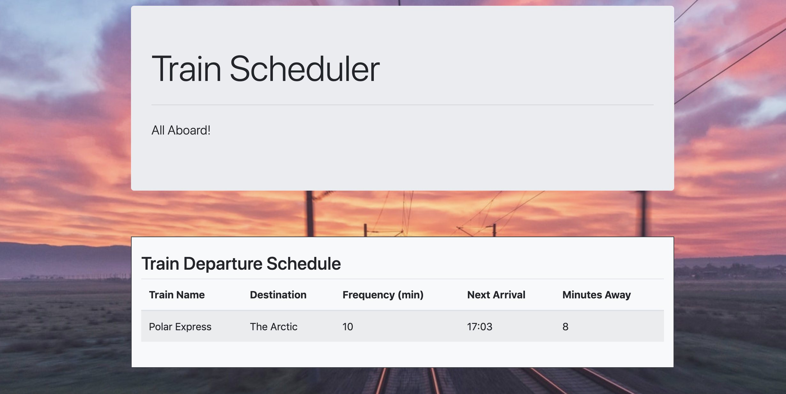

### Train Scheduler 

* Train Schedule app to show case my javascript skills, and my ability to work with google firebase, and to retrieve and manipulate information with moment.js
  
* Enter a train name, train destination, first train departure time, and train frequency

* The entered information is stored in a google firebase database 

* Based on the first train departure, and train frequency,  the next train arrival time and how many minutes away it is, is calculated based on what time it is on your browser

* Game Link: https://cmader555.github.io/trainscheduler/

## Installation 

* If you would like you can clone or download this code to your local machine

## Preview 

